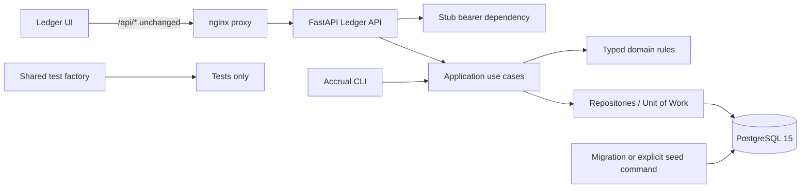

# Design: Ledger Clean Rewrite

## Overview

The rewrite uses typed domain rules, async PostgreSQL repositories, transaction-owning application services, a stable FastAPI contract, a React UI, and Docker Compose orchestration. Backend routes remain under `/api`; nginx preserves that prefix exactly; the dedicated `e2e-test` image is the only canonical Playwright environment.

**Spec location note:** `.kiro/specs/core-ledger/` is the intentional Kiro-native spec location for this request. Design evidence is sourced from `.specship/artifacts/reverse-engineering/`, especially the recon/RCA package; no duplicate mission is created.

## Architecture



### Layers and ownership

1. **Domain**: `Money`, `Account`, `RateTier`, `JournalLine`, entry status, and pure posting/accrual rules. Domain functions use Decimal and typed results/errors.
2. **Persistence**: SQLAlchemy 2 async repositories and unit-of-work. PostgreSQL constraints enforce one-sided lines, valid enums/tier, foreign keys, immutable-posting boundaries, one reversal, and one accrual per account/date.
3. **Application**: Posting, balance/statement, reversal, and accrual use cases own transaction boundaries. Posting locks referenced account UUIDs sorted ascending.
4. **API**: FastAPI routers, Pydantic schemas, stub bearer dependency, direct array/object success shapes, and deterministic `{error}` handlers. Routes never compute balances or interest.
5. **Job**: `python -m backend.jobs.accrual --date YYYY-MM-DD`, with structured output and nonzero failure exit.
6. **UI**: React Query API client and accessible feature components using shared Tailwind/shadcn primitives. Each feature implements loading, empty, error/retry, happy, and responsive states.
7. **Deployment/verification**: Compose starts PostgreSQL, API, frontend, and distinct one-shot test services. `frontend-test` runs Vitest only; `e2e-test` runs Playwright from the browser-equipped image only. The E2E runner targets the Compose frontend/API services over the internal network.

### Fixture ownership

Production bootstrap data is owned by `backend/migrations/versions/001_initial.py` and/or an explicit `backend/seed.py` command. Shared generated backend test data is owned by `backend/tests/fixtures/factories.py`; frontend unit fixtures live under `frontend/tests/`; browser fixtures live under repository-level `e2e/fixtures/`. Tests compare production seed output to a declared seed-equivalence contract; they do not use test fixtures as production truth.

### Confirmed proxy architecture

The backend continues to expose `/api/*`. Nginx uses an exact-prefix-preserving configuration such as `proxy_pass http://api:8000;` with no URI suffix. Preflight performs two independent requests: direct backend `/api/rate-schedule`, then frontend `/api/rate-schedule`; it prints each URL, status, and shape and identifies a direct-200/proxy-failure as a proxy defect.

## Components and Interfaces

### API routes

- `GET /health`: unauthenticated liveness, `{status: "ok"}`.
- `GET /ready`: unauthenticated readiness, verifies DB/schema.
- `GET /api/accounts`: authenticated plain array.
- `GET /api/accounts/{account_id}/balance`: authenticated direct object; malformed UUID 422; missing account 404; existing zero-balance account 200.
- `GET /api/accounts/{account_id}/statement`: authenticated direct object; malformed UUID 422; missing account 404; existing no-entry account 200 with empty lines.
- `GET /api/rate-schedule`: authenticated plain array.
- `POST /api/journal-entries`: authenticated, 201 direct entry object; validation and inactive-account failures 422; commit failure 500.
- `POST /api/journal-entries/{entry_id}/reverse`: authenticated, 201 direct reversing entry object; malformed UUID 422; missing/conflict cases follow the contract.

### Application interfaces

```text
PostingUseCase.post(lines: Sequence[PostingLineInput]) -> PostedEntry
BalanceUseCase.balance(account_id: UUID) -> Money
StatementUseCase.statement(account_id: UUID) -> Sequence[StatementLine]
ReversalUseCase.reverse(entry_id: UUID) -> PostedEntry
AccrualUseCase.run(as_of: date) -> AccrualRunResult
```

Repositories expose account lookup, ordered account locks, posted-line queries, entry creation, reversal lookup, accrual uniqueness lookup, and commit/rollback through a unit-of-work. Unexpected commit failure is translated after rollback to the deterministic 500 envelope.

### Error envelope

All application errors serialize to exactly `{ "error": "message" }`. Stable mappings are 401 authentication, 422 malformed UUID or validation, 404 missing account/resource, 409 reversal conflict, 500 unexpected persistence/commit failure, and 503 readiness failure. Framework validation handlers normalize malformed UUID responses to the same single-key envelope.

## Data Models

### Account

`id UUID PK`, `code VARCHAR(10) UNIQUE`, `name VARCHAR(255)`, `type enum`, `normal_balance enum(DEBIT,CREDIT)`, `rate_tier enum(standard,premium,savings)`, `active BOOLEAN`, `created_at TIMESTAMPTZ`.

### JournalEntry

`id UUID PK`, `status enum(DRAFT,POSTED)`, `posted_at TIMESTAMPTZ`, `reversal_of_id UUID nullable self-FK`, `is_accrual BOOLEAN`, `accrual_account_id UUID nullable FK`, `accrual_date DATE nullable`, timestamps. A partial unique index permits one reversal per original; a partial unique index enforces one accrual per account/date. Posted rows are immutable through the application and guarded by update/delete policy.

### JournalLine

`id UUID PK`, `entry_id FK`, `account_id FK`, `debit NUMERIC(18,4)`, `credit NUMERIC(18,4)`, `created_at`. Checks require nonnegative values, no line on both sides, and at least one nonzero side. Entry-level equality is enforced before commit.

### RateSchedule

`tier PK` constrained to `standard`, `premium`, `savings`; `annual_rate NUMERIC(8,6)`; timestamps. Fresh bootstrap seeds `0.035000`, `0.045000`, `0.050000`.

## Correctness Properties

*A property is a characteristic or behavior that should hold true across all valid executions of a system-essentially, a formal statement about what the system should do. Properties bridge human-readable requirements and executable correctness guarantees.*

The property reflection consolidated related persistence and invariant checks; each remaining property has unique validation value. All five are mandatory blocking tests.

### Property 1: Balanced posting preserves the double-entry invariant

For all valid collections of one-sided Decimal journal lines with at least two lines and equal debit and credit totals, posting SHALL persist exactly those lines in one Posted_Entry whose totals remain equal; for all generated invalid variants, rollback SHALL leave no entry or line.

**Validates: Requirements 4.1, 4.2, 4.3, 4.6**

### Property 2: Derived balances match normal-balance reference calculation

For all accounts and posted line collections, the derived balance SHALL equal debit-minus-credit for DEBIT accounts or credit-minus-debit for CREDIT accounts, at four-place Decimal precision, including zero-balance and no-line accounts.

**Validates: Requirements 3.5, 4.4, 4.5**

### Property 3: Reversal is an offsetting, balance-neutral append

For all reversible Posted_Entry values, reversing once SHALL append exactly one linked entry whose lines swap every original debit and credit, and original plus reversal SHALL contribute zero net amount to every referenced account.

**Validates: Requirements 5.1, 5.3**

### Property 4: Accrual uses the account tier and exact rounding rule

For all active eligible accounts with positive derived Decimal balances, dates, and authoritative rate tiers, the accrual amount SHALL equal half-up-to-four-places of `balance * tier.annual_rate / 365`, using the account's current `rate_tier`.

**Validates: Requirements 6.1, 6.2**

### Property 5: Accrual execution is idempotent per account/date

For all eligible account/date pairs, running an Accrual_Run twice with the same date SHALL create at most one accrual entry and SHALL return the same effective result on the second run, while zero/negative balances remain deterministic skips.

**Validates: Requirements 6.3, 6.4**

## Error Handling

- Domain errors are typed and mapped at the API boundary; domain code does not raise HTTP exceptions.
- Pydantic/framework UUID failures are normalized into one deterministic 422 Error_Envelope.
- Inactive account posting is a deterministic 422 policy failure.
- Unknown account/resource is 404; existing zero-balance/no-entry accounts are successful responses.
- Reversal missing/non-posted/self/already-reversed cases use stable 404/409 mappings and never mutate history.
- Unexpected flush or commit failures always rollback before connection reuse, return deterministic non-sensitive 500, and are covered by a real integration test.
- Accrual CLI logs account-level skips/failures, commits successful work according to unit-of-work policy, and exits nonzero when the run cannot complete its contract.
- Proxy preflight reports direct and proxied URL/status independently without exposing credentials.

## Testing Strategy

### Commands and gates

All commands are one-shot, not watch commands. From the repository root:

```bash
docker compose up -d postgres
docker compose run --rm api alembic upgrade head
docker compose run --rm api pytest backend/tests/unit backend/tests/property --cov=backend/engine --cov=backend/api --cov=backend --cov-report=term-missing --cov-fail-under=70
docker compose run --rm api pytest backend/tests/unit backend/tests/property --cov=backend/engine --cov-fail-under=85
docker compose run --rm api pytest backend/tests/api --cov=backend/api --cov-fail-under=75
docker compose run --rm frontend-test pnpm test -- --run --coverage --coverage.thresholds.lines=60
docker compose run --rm api pytest backend/tests/performance/test_balance_latency.py -q

docker compose --profile app --profile test run --rm e2e-test
```

The balance performance gate asserts p95 `< 200ms` over the declared repeat count. Backend engine coverage is `>=85%`, backend API coverage `>=75%`, backend overall coverage `>=70%`, and frontend coverage `>=60%`. The `frontend-test` service runs Vitest only. The separate `e2e-test` service mounts repository-level `e2e/` read-only, uses Chromium installed in the image, and targets the Compose `frontend` service through `E2E_BASE_URL=http://frontend`.

### Test layers

- **Unit**: domain precision, validation, deterministic error mapping, UI components, API client state transitions.
- **Property**: Hypothesis, minimum 100 examples per property, exactly one blocking test per design property, tagged `Feature: core-ledger, Property N: ...`.
- **Integration**: real PostgreSQL migration/bootstrap, seed equivalence, rollback after commit failure, inactive/zero-balance account policy, concurrency, API contracts, and nginx routing.
- **Browser**: canonical container Playwright with explicit state sequences for empty accounts/rates, API error, retry/recovery, posting validation failure, reversal conflict, loading, seeded happy path, and responsive layout.

### Test directory ownership

- **Backend**: `backend/tests/` owns unit, API, integration, property, and backend fixture tests.
- **Frontend**: `frontend/tests/` owns Vitest unit/component tests and frontend fixtures; tests are not co-located under `frontend/src/`.
- **E2E**: repository-level `e2e/` owns Playwright configuration, specs, and browser fixtures. It is mounted read-only into `e2e-test`.
- **Container boundaries**: `api-test` runs pytest, `frontend-test` runs Vitest, and `e2e-test` runs Playwright. No service silently runs another layer's suite.

### Browser/UI state sequences

- **Accounts/rates empty**: `idle -> loading -> success(empty) -> explanatory empty copy`; rates use the same sequence.
- **API error and retry/recovery**: `idle -> loading -> error(Error_Envelope) -> retry -> loading -> success`; no stale false success.
- **Statement**: `unselected -> selected -> loading -> success(lines)` or `success(empty)`; failure follows `loading -> error -> retry`.
- **Posting validation failure**: `closed -> open -> editing -> submit invalid -> inline deterministic 422 -> editing`; form values remain and no success banner appears.
- **Posting happy/loading**: `editing -> submitting(disabled controls) -> success -> accounts/statement refresh`.
- **Reversal conflict**: `posted row -> confirmation -> submitting -> conflict -> original row preserved`; cancellation returns to posted row without mutation.
- **Responsive**: repeat loading, empty, error, posting, and statement checks at narrow viewport; line editors stack and statement content has no horizontal clipping.

## Traceability and evidence

The design is based on `.specship/artifacts/reverse-engineering/architecture-rebuild-recommendation.md`, `change-impact-map.md`, `api-contracts.md`, `data-models.md`, `preserved-behaviors.md`, and `test-baseline.md`. The mission's `artifacts/` directory remains complete, including `api-contract.md`, `api-contract-tests.md`, `browser-flows.md`, `edge-cases.md`, `test-cases.md`, `ui-state-sequences.md`, and `reverse-engineering/source.txt`.
